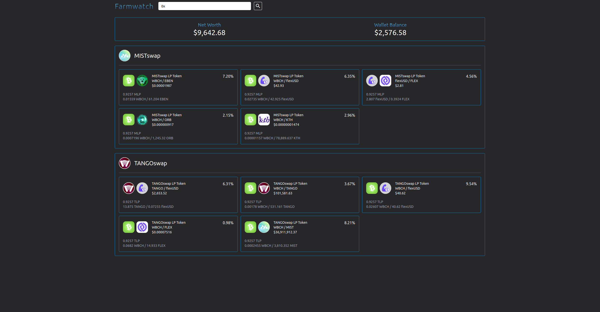

# Farmwatch

Smart Bitcoin Cash crypto wallet holdings tracker.

> **NOTE** : Smart Bitcoin Cash (smartBCH for short) is a sidechain for Bitcoin Cash. It is compatible with Ethereum's EVM and Web3 API.

The application is a client-side only tracker for wallet holdings and smart contract tokens, such as liquidity pools, used in decentralized exchanges (DEXs).

The application gathers all the positions held by the wallet address in supported DEXs and calculates a market value.

Supported exchanges:
- [Mistswap](https://mistswap.fi/)
- [Tangoswap](https://tangoswap.cash/smart-swap)

> **NOTE** : More exchanges could be easily supported since they expose the same Web3 API and are forked either from [uniswap](https://uniswap.org/) or [sushiswap](https://www.sushi.com/), the two most populars DEXs on Ethereum

This project's aim was to develop an application interacting with smart contracts on an EVM-compatible blockchain using the Web3 API.

## Screenshots
Landing page : *insert your wallet address*


Portofolio Summary


## Usage
Install the dependencies
```
npm install
```

Run the app
```
npm start
```
